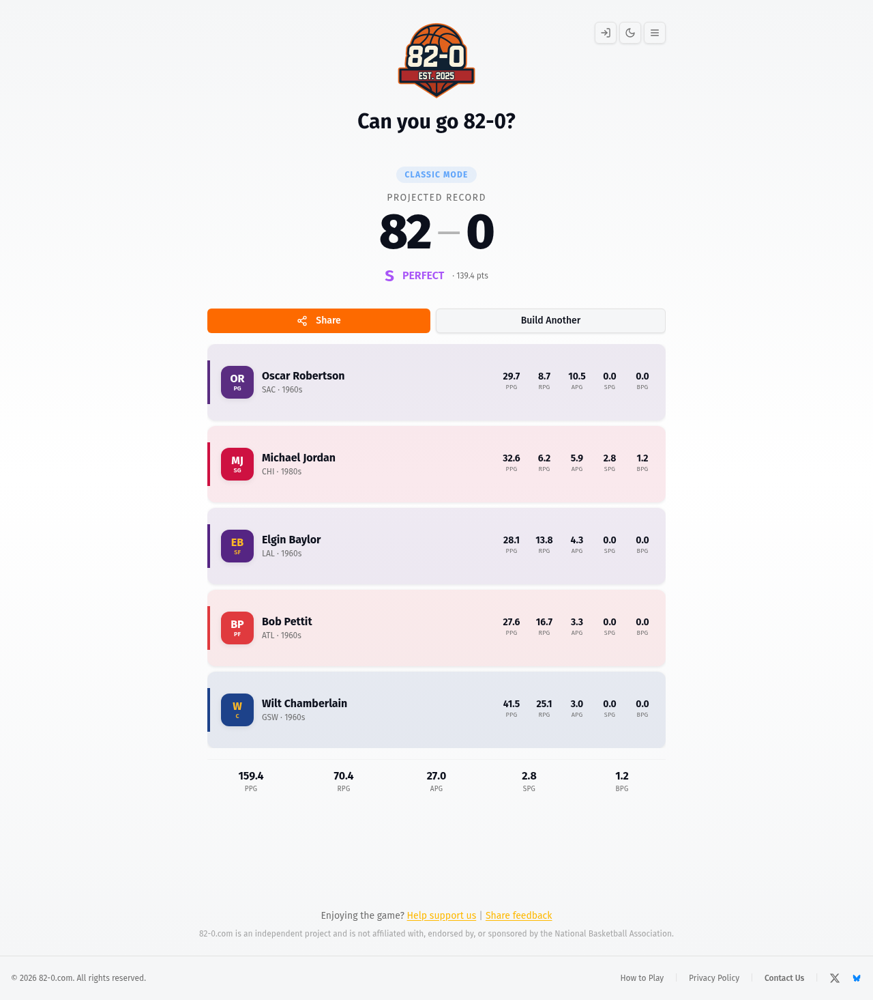
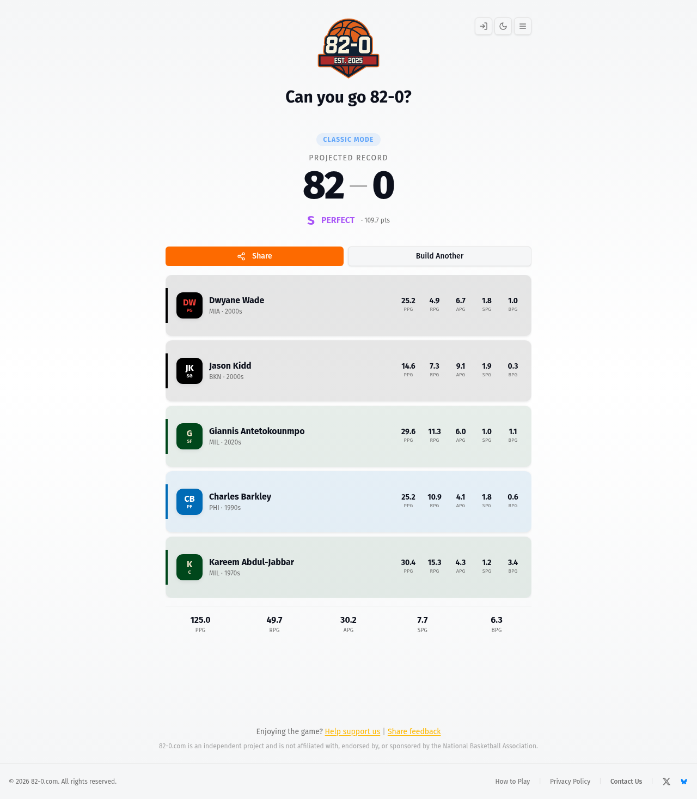

# 82-0 Solver

Automated solvers for the viral online game **[82-0.com](https://www.82-0.com)** — a
basketball roster-building game where the goal is to assemble a five-player lineup
strong enough to "go 82-0" (win all 82 games of a season).

This repo contains two agents that both reach the perfect 82-0 record, albeit by
different philosophies, plus the reverse-engineering and tooling behind them:

- **Force-win agent** — guarantees 82-0 on the first try by controlling the game's randomness.
- **Honest-play agent** — wins legitimately, by the real rules, through fast repeated attempts.

---

## The game

Each game ("Classic" mode) is 5 rounds:

1. A slot machine spins and lands on a random **(team, decade)** combination.
2. You may place **one** player from that team/decade into one of five court
   slots — **PG, SG, SF, PF, C** — that the player is eligible for.
3. After 5 picks you have a full lineup, and the game computes a projected
   season record. Hit **82-0** and you get the top grade.

You also get **one Team-skip and one Era-skip per game** to re-roll a weak spin
along one axis (described below).

## How it actually works (reverse-engineered)

82-0.com is a **Next.js app whose entire simulation runs client-side** — no
server adjudicates your record, which is what makes both agents possible. The
relevant logic was recovered from the site's JavaScript bundles (see `chunks/`).

### The slot machine

Each spin builds the list of all valid `(team, decade)` pairs that have at least
one player, then picks uniformly at random:

```js
n = [{team, decade} for team in availableTeams for decade in availableDecades
     if getPlayersByTeamAndDecade(team, decade).length > 0];
result = n[Math.floor(Math.random() * n.length)];   // 180 valid combos
```

There are **180 valid combinations**. Your roster quality is mostly decided by
*what the spins offer you*, not by picking skill — picking optimally is easy.

### Skips

You get one Team-skip and one Era-skip per game. They re-roll a single axis:

- **Skip Team** → locks the current decade, excludes the current team, and
  re-rolls a new team valid for that decade.
- **Skip Era** → locks the current team, excludes the current decade, and
  re-rolls a new decade valid for that team.

Each disables after one use; both may be spent in the same round.

### The scoring formula

A lineup's `teamOvr` is a weighted, normalized sum of its five players' stats:

```
teamOvr = 100 · ( Σppg/133.4 · .46
                + Σrpg/39.7  · .25
                + Σapg/29.3  · .18
                + adjSpg/6.1 · .07
                + adjBpg/3.2 · .04 )          (rounded to 1 decimal)

wins = round( 82 · min(teamOvr/110, 1) ^ 1.15 )
```

**To get `wins = 82` (a perfect 82-0) you need a `teamOvr` of roughly 109.5 or
higher.** Anything below that rounds down to 81 wins or fewer (`min(teamOvr/110, 1)`
also caps the curve, so there's no reward for overshooting the line). `teamOvr` is
exactly the "pts" number the result screen shows.

For reference, from my own results:

| `teamOvr` | Record | Notes |
|----------:|:------:|-------|
| 96.9 | 71-11 | a solid-but-losing lineup |
| 104.1 | 77-5 | close, still short of the line |
| 109.4 | 81-1 | *just* misses — one point of `teamOvr` away |
| **109.7** | **82-0** | my first honest-play win — barely over the line |
| 139.4 | 82-0 | the force-win agent, overshooting massively (capped at 82-0) |

> Note: `teamOvr` depends only on the *set* of five players, not on which slot
> each fills — slots only enforce position eligibility.

## Key finding: no stat imputation for older eras

Steals and blocks weren't tracked in the early NBA, so most players from the
1950s–60s have **null `spg`/`bpg`** in the data. The game does **not** impute
zeros for them. Instead, the steals/blocks terms average over **only the players
who have the stat**, then multiply by 5:

```js
adj(values) = mean(values that are non-null & > 0) × 5
```

This has two big consequences, both exploitable:

1. **Older-era stars pay no penalty** for missing defensive stats — a 1960s
   roster isn't dragged down by zeros it never had.
2. **One modern defender's stats get amplified across the whole team.** In the
   force-win lineup below, only Michael Jordan has steals/blocks
   (2.81 SPG, 1.18 BPG). The game treats the team as if *all five* averaged his
   numbers (`adj` = 14.05 steals, 5.90 blocks), contributing **~23.5 of the
   139.4 total `teamOvr`** from a single player.

The optimal strategy that falls out of this: stack older-era scoring/rebounding
legends (no defensive penalty) and add one elite modern perimeter/rim defender
to amplify the steals and blocks terms.

---

## The agents

### Force-win agent — `agents/force_win.js`

Overrides `Math.random` in the page (via Playwright `addInitScript`) *before any
game script runs*, so the slot machine lands on exactly the `(team, decade)` we
want each round. It reconstructs the 180-combo list offline to compute the index
that forces each target, then places the optimal player.

**Result: a guaranteed 82-0 every run, first try.** Verified live:

| Slot | Player | Team · Era | PPG | RPG | APG | SPG | BPG |
|------|--------|-----------|----:|----:|----:|----:|----:|
| PG | Oscar Robertson | SAC · 1960s | 29.7 | 8.7 | 10.5 | — | — |
| SG | Michael Jordan | CHI · 1980s | 32.7 | 6.2 | 5.9 | 2.81 | 1.18 |
| SF | Elgin Baylor | LAL · 1960s | 28.1 | 13.8 | 4.3 | — | — |
| PF | Bob Pettit | ATL · 1960s | 27.6 | 16.7 | 3.3 | — | — |
| C | Wilt Chamberlain | GSW · 1960s | 41.5 | 25.1 | 3.0 | — | — |

→ **`teamOvr = 139.4`**, record **82-0**, grade **S / PERFECT**.



```bash
node agents/force_win.js
```

### Honest-play agent — `agents/honest_play.js` + `agents/honest_live.js`

The human-like counterpart: it **never touches `Math.random`**. Each round it
reads the offered `(team, decade)` from the game's own console log, places the
best available player for an open slot, and spends its one Team-skip / one
Era-skip when a spin is weak (decided by a one-step expected-value lookahead).
After 5 picks it checks the record; if it isn't 82-0 it clicks **Build Another**
and replays. It wins through volume of fast attempts, not certainty per game.

`agents/honest_play.js` is the shared brain and also an **offline Monte-Carlo
simulator** to measure how often honest play can win. Across 30,000 simulated
games per setting:

| Skip margin | P(win) / game | ~games per win | mean `teamOvr` | best `teamOvr` |
|------------:|--------------:|---------------:|---------------:|---------------:|
| 0.0 | 0.74% | ~135 | 91.8 | 129.4 |
| 0.5 | 0.76% | ~132 | 92.1 | 125.3 |
| **1.0** | **0.92%** | **~109** | 92.2 | 123.4 |
| 2.0 | 0.69% | ~145 | 92.2 | 127.1 |

So honest play reaches 82-0 roughly **1 game in ~109** (margin 1.0 is optimal —
skipping too eagerly wastes skips).

**Verified live: the honest agent achieved a real 82-0 on game 13**, with its
computed record matching the on-page `PROJECTED RECORD` exactly (no RNG override
involved):

| Slot | Player | Team · Era | PPG | RPG | APG | SPG | BPG |
|------|--------|-----------|----:|----:|----:|----:|----:|
| PG | Dwyane Wade | MIA · 2000s | 25.2 | 4.9 | 6.7 | 1.8 | 1.0 |
| SG | Jason Kidd | BKN · 2000s | 14.6 | 7.3 | 9.1 | 1.9 | 0.3 |
| SF | Giannis Antetokounmpo | MIL · 2020s | 29.6 | 11.3 | 6.0 | 1.0 | 1.1 |
| PF | Charles Barkley | PHI · 1990s | 25.2 | 10.9 | 4.1 | 1.8 | 0.6 |
| C | Kareem Abdul-Jabbar | MIL · 1970s | 30.4 | 15.3 | 4.3 | 1.2 | 3.4 |

→ **`teamOvr = 109.7`**, record **82-0**, grade **S / PERFECT**.



```bash
node agents/honest_live.js [maxGames]    # plays the real site, replaying until 82-0 (default 3)
node agents/honest_play.js sim [games]   # offline win-rate simulation (default 50000)
```

---

## Results summary

| Agent | Approach | Outcome |
|-------|----------|---------|
| Force-win | Override the RNG to force optimal spins | **82-0 guaranteed, first try** (`teamOvr` 139.4, grade S/PERFECT) |
| Honest-play | Play by the rules, replay until lucky | **82-0 achieved live on game 13** (`teamOvr` 109.7, grade S/PERFECT); ~1 win in 109 games is the best expected win rate (simulated) |

## Repository layout

| Path | What it is |
|------|------------|
| `agents/force_win.js` | Force-win agent (RNG override) |
| `agents/honest_play.js` | Honest-play strategy brain + Monte-Carlo simulator |
| `agents/honest_live.js` | Honest-play live Playwright driver |
| `tools/solve.py` | Offline roster optimizer (local search over the player DB) |
| `tools/` | Recon / verification scripts (`sel.js`, `verify.js`, `explore*.js`, `explore_honest.js`, `explore_skip.js`) |
| `data/players_flat.json` | Player database (10,932 players: team, era, position, per-game stats) |
| `data/players_meta.json` | Source metadata for the player DB |
| `chunks/` | Decompiled site JS bundles used for reverse-engineering |
| `images/` | Result screenshots + recon shots |
| `index.html` | Local harness |

## Setup

```bash
npm install            # installs playwright-core
# uses system Chromium at /usr/bin/chromium (adjust executablePath if different)
```

## Disclaimer

This project is for **educational and research purposes** — reverse-engineering a
client-side game to study its mechanics and build solver agents.
